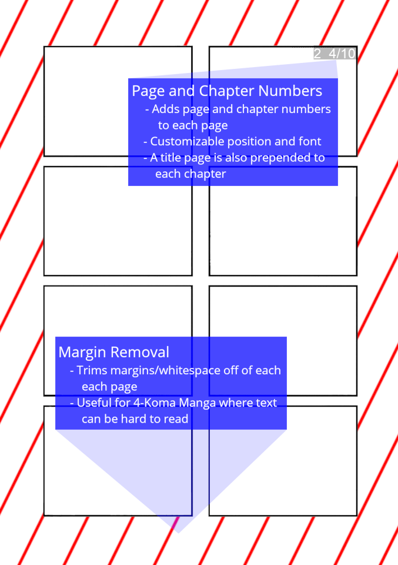

# MangaPDF
Converts manga to a PDF to be read by Kindle.  Combines all chapters of a manga and combines
all images to a single PDF file.  This PDF file will have features to make reading on a 
Kindle more enjoyable.

Features:
* Addition of title page before each chapter
* Addition of chapter numbers and page numbers
* PDF bookmarks of chapters
* OCRmyPDF on output file
* Margin or whitespace removal.  Good for 4-Koma manga
* Might add soon: Color detection, multithreading, bulk conversions
 
The input manga has this structure:
```
MangaRootFolder
├── scangroupA Ch.1
│   ├── 0.jpg
│   ├── 1.jpg
│   └── 2.jpg
├── scangroupA Ch.2
└── scangroupB Ch.3
```
This is the structure used by programs like Tachiyomi.

Preview:



## Requirements
Python, Pillow, PyPDF2, tqdm, ocrmypdf.  More information can be seen in `requirements.txt`

## Install
Clone the repo, cd into the repo, install requirements
```
git clone https://github.com/azusalad/mangapdf.git
cd mangapdf
pip install -r requirements.txt
```

## Running
Help message:
```
usage: main.py [-h] -i INPUT -o OUTPUT [--delete | --no-delete]

options:
  -h, --help            show this help message and exit
  -i INPUT, --input INPUT
                        Path to input manga
  -o OUTPUT, --output OUTPUT
                        Output directory
  --delete, --no-delete
                        Delete temporary pdf files after compilation
```
Edit the `config.py` file to alter more settings such as fonts used.  After running the
program, the final combined pdf will be placed inside the output directory.

### Example Usage
Input:
```
python main.py -i path/to/MangaRootFolder -o path/to/MangaOut --title "My Favorite Manga!" --author "Author's name"
```
Output:
```
Starting conversion: path/to/MangaRootFolder -> path/to/MangaOut/My Favorite Manga!.pdf
100%|███████████████████████| 3/3 [00:00<00:00,  4.20it/s]
Your manga is done!  The path is path/to/MangaOut/My Favorite Manga!.pdf
```


